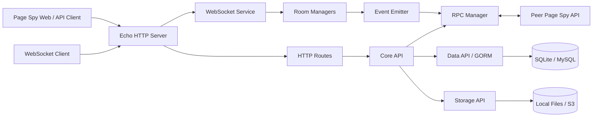
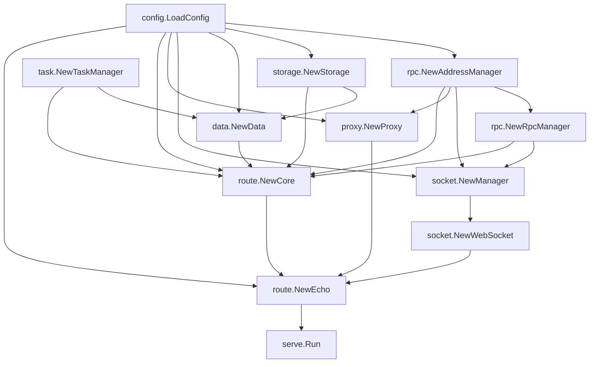
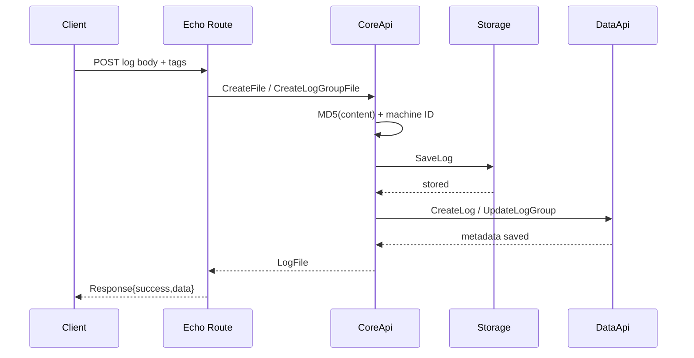
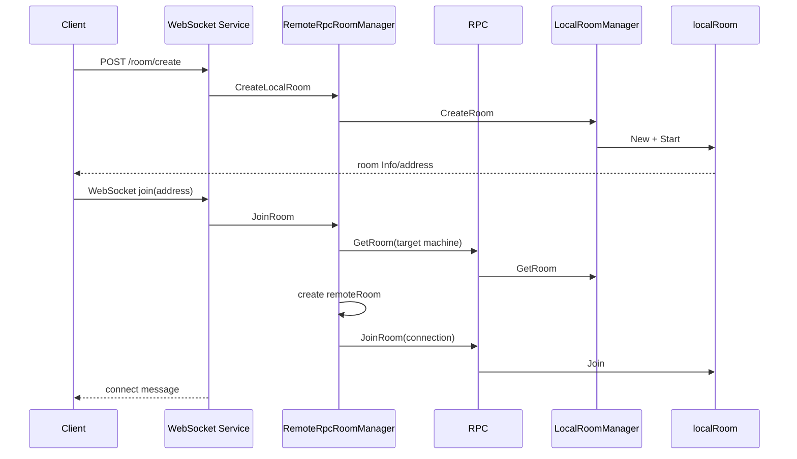
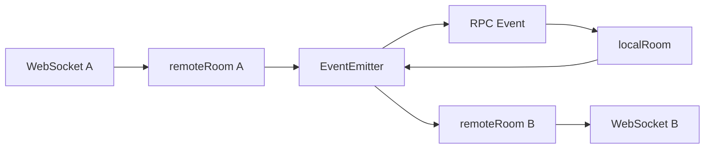
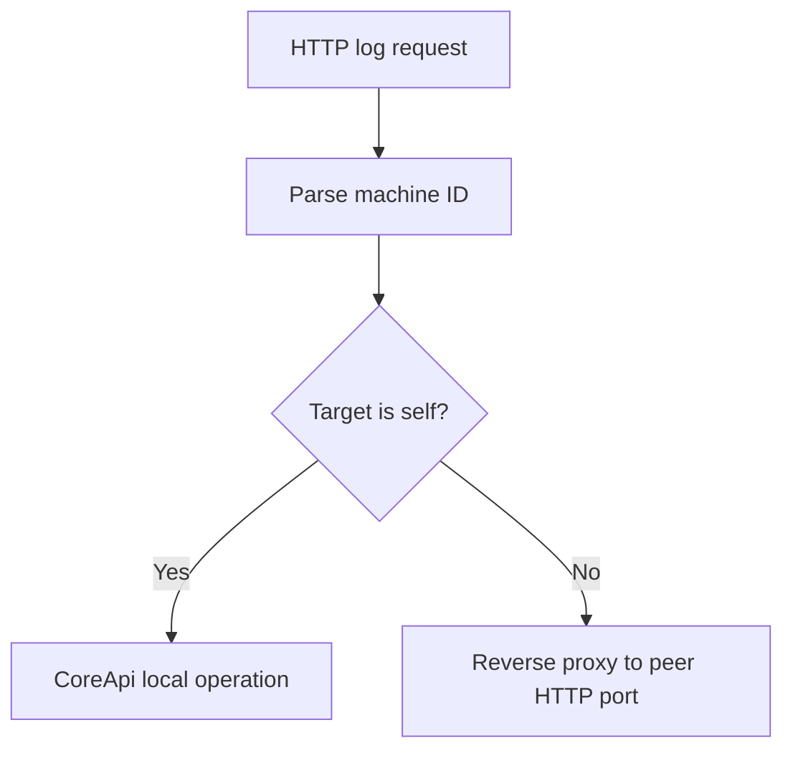
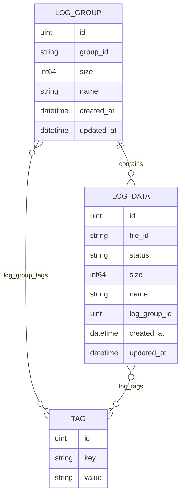
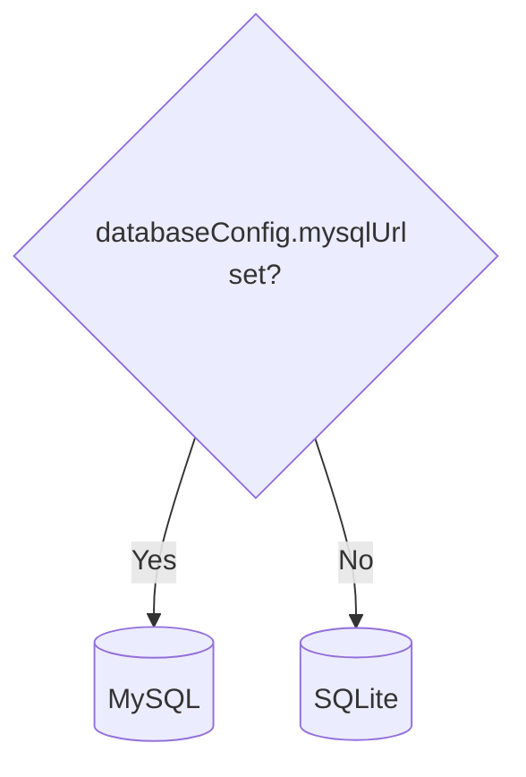
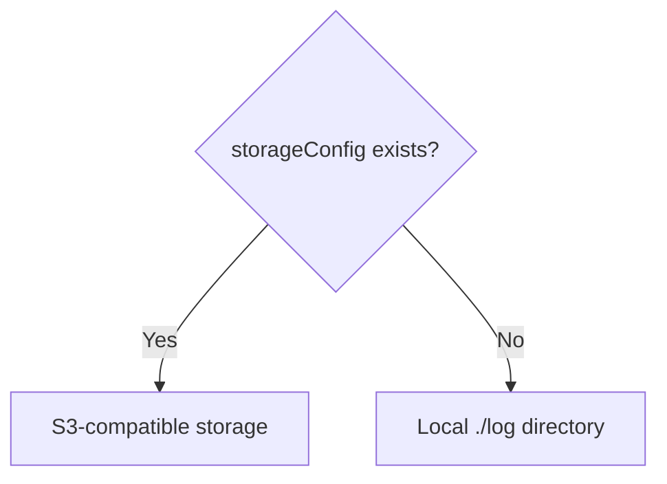

# Page Spy API Architecture

English | [中文](./ARCHITECTURE_ZH.md)

This document describes the current module boundaries, startup sequence, data model, message paths, storage design, and multi-instance topology of Page Spy API.

## 1. Design goals

Page Spy API divides remote debugging into two capability groups:

1. Real-time channels: rooms and WebSockets forward messages between debugger and debug target.
2. Persistent logs: upload, query, download, group, and retain debugging logs.

The service supports:

- Single-instance mode with a random internal RPC port and machine ID `local`.
- Multi-instance mode using a fixed RPC node list.
- Local deployments using SQLite and the local filesystem.
- External infrastructure using MySQL and S3-compatible storage.
- An integrated binary that also hosts Page Spy Web.
- Embedding as a Go module in a custom application.

## 2. System overview



HTTP and WebSocket traffic share the configured application port. Internal RPC uses a separate port and the `/rpc` path.

## 3. Repository layout

```text
page-spy-api/
├── api/
│   ├── event/              shared event addresses, packages, and interfaces
│   └── room/               room, connection, message, error, and interface types
├── bin/
│   └── main.go             embeds dist and starts the complete service
├── config/                 models, defaults, file loading, and environment overrides
├── container/              dig dependency-injection container
├── data/                   GORM models and SQLite/MySQL implementation
├── event/                  local event bus and remote event RPC service
├── logger/                 global logrus entry point
├── metric/                 injectable metrics abstraction with a no-op default
├── proxy/                  multi-instance HTTP reverse proxy
├── room/                   local/remote rooms and RPC room management
├── rpc/                    node addresses, RPC server/client, and result aggregation
├── serve/
│   ├── common/             common HTTP response types
│   ├── middleware/         authentication, CORS, logging, errors, and cache
│   ├── route/              HTTP routes and log-domain operations
│   └── socket/             WebSocket handshake, session, and message loops
├── state/                  atomic state machine
├── static/                 SPA fallback filesystem
├── storage/                local file and S3 implementations
├── task/                   periodic task scheduler
├── test/
│   ├── docker/             manual MySQL environment
│   └── websocket_event_test/ browser WebSocket test page
└── util/                   file, network, time, byte, and hash helpers
```

### 3.1 API and implementation separation

`api/event` and `api/room` contain shared types and interfaces. Their implementations live in the top-level `event` and `room` packages.

This separation allows:

- `serve/socket` to depend on room interfaces instead of a concrete local room.
- Local and remote rooms to use the same message model.
- RPC responses to reuse domain error types.
- Tests to replace events, rooms, data, or storage with small fakes.

## 4. Startup and dependency injection

The project uses `go.uber.org/dig`.

### 4.1 Entry point

`bin/main.go`:

1. Embeds `bin/dist/*`.
2. Provides `*config.StaticConfig` to the container.
3. Calls `serve.Run()`.

A backend-only host must still provide the same type, but it may return `nil`.

### 4.2 Provider graph



### 4.3 Constructor side effects

Several constructors start runtime behavior:

- `rpc.NewRpcManager` starts the RPC HTTP server asynchronously.
- `socket.NewManager` starts local and remote room managers and registers room and event RPC services.
- `data.NewData` registers database synchronization in remote-storage mode.
- `route.NewCore` registers local log cleanup and the Core RPC service.
- `route.NewEcho` registers middleware, HTTP routes, WebSocket routes, and static files.
- `serve.Run` starts the Echo HTTP server.

Constructor changes must account for these side effects and their order.

## 5. Address and node model

### 5.1 Single instance

Without `rpcAddress`:

- The machine ID is `local`.
- The internal RPC address is `127.0.0.1:<random-port>`.
- Room and connection addresses have the form `<uuid>.local`.

### 5.2 Multiple instances

With configured RPC addresses, every `ip:port` is sorted and assigned:

```text
A0
A1
A2
...
```

The current node is resolved through `selfRpcAddress` or local-IP matching. Every node must use the same list, or the same machine may receive different IDs.

The reverse proxy combines a peer IP with the local node's configured HTTP `port`, so every cluster node must also use the same HTTP port.

### 5.3 Identifier formats

| Object | Format | Example |
| --- | --- | --- |
| Room address | `<local-id>.<machine-id>` | `9a...f2.A0` |
| Connection address | `<local-id>.<machine-id>` | `52...c1.A1` |
| Log file ID | `<machine-id>.<md5>` | `A0.098f6bcd...` |

The machine ID in a room or connection address determines the target for room and event RPC. The first part of a log file ID determines which node handles downloads and deletion.

## 6. HTTP layer

### 6.1 Middleware order

Echo registers these global middleware:

1. Request logging and `X-Request-ID`.
2. Common error responses.
3. CORS.

The protected route group additionally uses JWT authentication. Authentication is bypassed when no system password is configured.

### 6.2 Route groups

```text
/api/v1
├── public
│   ├── POST /auth/verify
│   ├── POST /room/create
│   ├── GET  /room/check
│   ├── GET  /ws/room/join
│   ├── POST /log/upload
│   ├── POST /jsonLog/upload
│   └── POST /logGroup/upload
└── protected
    ├── GET    /auth/status
    ├── GET    /room/list
    ├── GET    /log/count
    ├── GET    /log/download
    ├── GET    /log/list
    ├── DELETE /log/delete
    ├── GET    /logGroup/list
    ├── GET    /logGroup/files
    └── DELETE /logGroup/delete
```

When static files are configured, a final `/*` route serves them with `index.html` as an SPA fallback.

### 6.3 Log upload flow



The current order is “file first, metadata second.” There is no transaction across the storage and database boundaries, so partial failures may leave orphaned files or metadata.

### 6.4 Query, download, and deletion

- List operations call `CoreApi.FindLogs` or `FindLogGroups` on every RPC node, merge the results, and sort by creation time.
- Log lists are deduplicated by file ID.
- Downloads use the machine ID in the file ID to choose local handling or HTTP reverse proxying.
- Deletion chooses the target the same way, then removes the body and database row.

## 7. Rooms and WebSockets

### 7.1 Core objects

| Object | Responsibility |
| --- | --- |
| `LocalRoomManager` | Stores real rooms created on the current node. |
| `RemoteRpcRoomManager` | Cluster-wide room facade used by HTTP and WebSocket handlers. |
| `localRoom` | Maintains room information, connections, and broadcast behavior. |
| `remoteRoom` | Represents one WebSocket connection's session with a target room. |
| `LocalEventEmitter` | Delivers local events keyed by connection address. |
| `RpcEventEmitter` | Injects events from another node into the local event bus. |

### 7.2 Create and join flow



Even for a local room, `RemoteRpcRoomManager` uses the local RPC client. This keeps the single-node and multi-node paths consistent.

### 7.3 Message flow

Clients may send:

```text
ping
broadcast
message
updateRoomInfo
```

Broadcast and direct-message routing:



`event.Package` is the envelope used to move room messages across nodes. It carries:

- `From`
- `CreatedAt`
- `RequestId`
- `RoutingKey`
- JSON `Content`

### 7.4 State and timeout behavior

The shared state machine contains:

```text
Init -> Running -> Close
             \-> Error
```

Room managers inspect rooms every ten seconds:

- An initialized room with no connections for one minute is closed.
- A running room with no users for one minute is closed.
- A running room with no activity for five minutes is closed.
- A local room older than one hour is closed.
- A remote room inactive for twenty seconds or older than one hour is closed.

These durations are code constants, not `config.json` fields.

## 8. RPC and cluster communication

### 8.1 Protocol

The RPC server uses the Gorilla RPC JSON codec:

```text
POST http://<node-ip>:<rpc-port>/rpc
Content-Type: application/json
```

Requests carry a method, one-element parameter array, and incrementing ID. Main services:

| RPC service | Purpose |
| --- | --- |
| `LocalRpcRoomManager` | Create, query, update, join, leave, and remove rooms. |
| `RpcEventEmitter` | Deliver an event to a connection on the target node. |
| `CoreApi` | Query a node's local logs and log groups. |

### 8.2 RPC versus HTTP proxying

- Room control, event delivery, and list aggregation use RPC.
- Log download and deletion use the Echo-level reverse proxy when the target is remote.



## 9. Data and storage

### 9.1 Domain data model



At startup, GORM migrates `LogGroup`, `LogData`, and `Tag`.

Log states:

- `Created`
- `Saved`
- `Error`
- `Unknown`

The normal creation path stores `Saved`.

### 9.2 Database selection



SQLite path order:

1. `data.db` in the working directory.
2. `data/data.db`.
3. Create `data/data.db` when neither exists.

### 9.3 Log-body storage selection



`StorageApi` exposes:

- `SaveLog`
- `GetLog`
- `ExistLog`
- `RemoveLog`
- Generic-path `Save`, `Get`, and `Exist`

The local implementation uses `./log`. The S3 implementation stores log bodies under `baseDir/logDir/fileId`.

### 9.4 Background tasks

| Task | Condition | Interval | Purpose |
| --- | --- | --- | --- |
| `clean_file` | local file storage | 10 minutes | Remove logs by total capacity and creation time. |
| `sync_data_file` | remote object storage | 5 minutes | Sync the local SQLite file to object storage. |
| room manager loop | always | 10 seconds | Remove closed or timed-out rooms. |

`metric` uses a no-op implementation by default. A host application can inject monitoring through `metric.SetMetric`.

## 10. Static files

`StaticConfig.Files` must contain a directory named `dist`. Echo wraps it in a fallback filesystem:

- Existing paths return the corresponding static file.
- Missing paths return `index.html` for frontend history routing.

The cache middleware is attached only to the static wildcard route, not `/api/v1`.

## 11. Extension guide

### 11.1 Add an HTTP API

1. Choose the public or protected group in `serve/route/route.go`.
2. Keep complex logic in `CoreApi` or a dedicated domain service.
3. Use `common.NewSuccessResponse` and the common error middleware.
4. Decide whether the operation is local, RPC-aggregated, or HTTP-proxied in a cluster.
5. Add parameter, authentication, error-path, and multi-node tests.

### 11.2 Add a WebSocket message

1. Add a type constant and content structure in `api/room/room.go`.
2. Update `NewMessageContent`.
3. Decide whether `IsPublicMessageType` should accept it.
4. Implement routing in `remoteRoom` and/or `localRoom`.
5. Verify `roomMessageToPackage` and `packageToRoomMessage` serialization.
6. Test local, cross-node, malformed-message, and shutdown paths.

### 11.3 Add a storage implementation

Implement `storage.StorageApi` and select it explicitly in `storage.NewStorage`. Preserve:

- Stable file IDs and object keys.
- Caller ownership of readers returned by `Get`.
- A distinction between missing objects and actual storage failures.
- A defined compensation strategy when body and metadata operations partially fail.

### 11.4 Add a database implementation

`data.DataApi` is the domain boundary. A new implementation must preserve:

- Unix-second input for time ranges.
- Consistent multi-tag query semantics.
- One-based pagination.
- Compatible JSON models.
- `Page.Merge`, ordering, and deduplication behavior during cluster aggregation.

## 12. Constraints and risk boundaries

The current implementation has important boundaries:

- Authentication is off by default, and public upload and WebSocket routes do not use JWT middleware.
- RPC listens on all interfaces and has no built-in authentication or TLS.
- HTTP and WebSocket bodies have no common size or rate limit.
- File bodies and database metadata do not share a transaction.
- Cross-node lists paginate on each node before merging, which is not strict global pagination.
- Cross-node RPC runs sequentially, and one node failure fails the whole operation.
- S3 mode syncs an active SQLite file; multiple nodes can overwrite a shared snapshot.
- The global container, logger, and metric instances are process-wide and require test isolation.
- Some constructors immediately start goroutines or listeners and are not pure constructors.

Changes around these boundaries require an explicit compatibility and migration plan.

## 13. Key source entry points

| Concern | Entry points |
| --- | --- |
| Process startup | `bin/main.go`, `serve/run.go` |
| Dependency graph | `container/container.go` |
| Configuration | `config/load.go`, `config/config.go` |
| HTTP routes | `serve/route/route.go` |
| Log-domain logic | `serve/route/core.go` |
| WebSocket sessions | `serve/socket/socket.go` |
| Room management | `room/local_manager.go`, `room/rpc_remote_manager.go` |
| Room messages | `room/local_room.go`, `room/remote_room.go`, `room/message.go` |
| Event routing | `event/local_event.go`, `event/rpc_event.go` |
| RPC topology | `rpc/address.go`, `rpc/rpc.go`, `rpc/rpc_client.go` |
| Database | `data/db.go`, `data/logs.go` |
| Local/S3 storage | `storage/file.go`, `storage/s3.go` |
| Periodic tasks | `task/task.go` |
