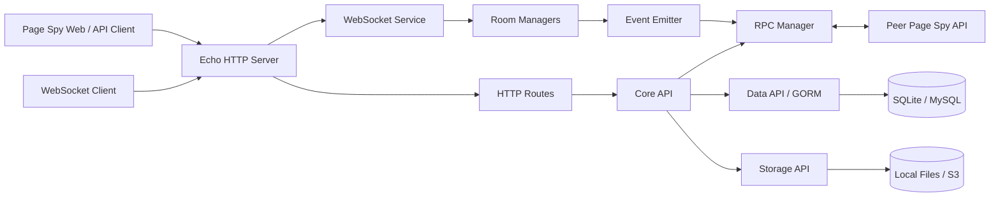
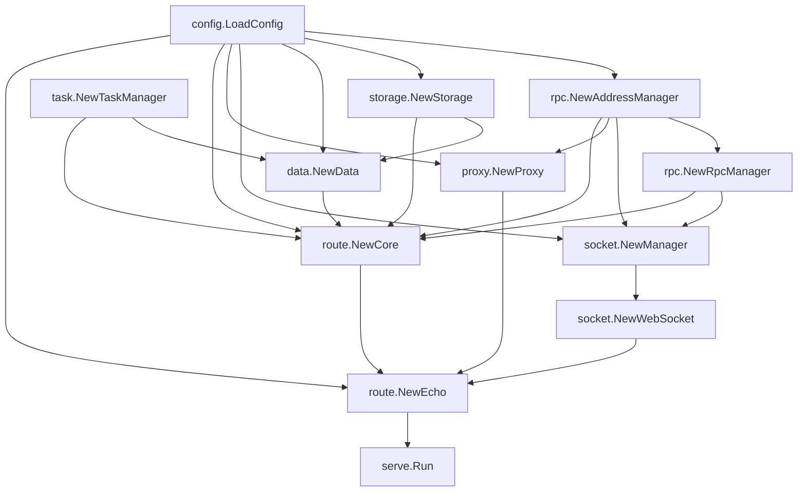
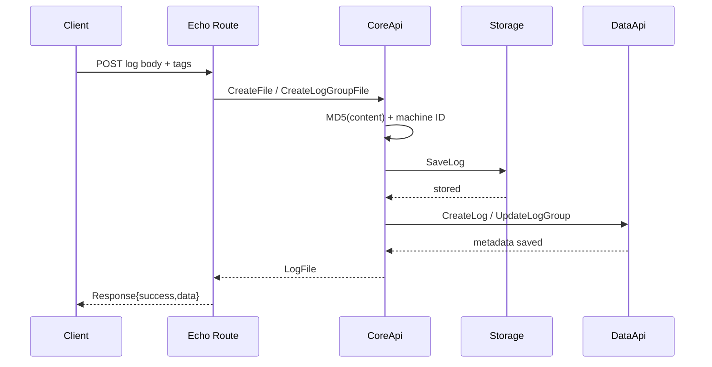
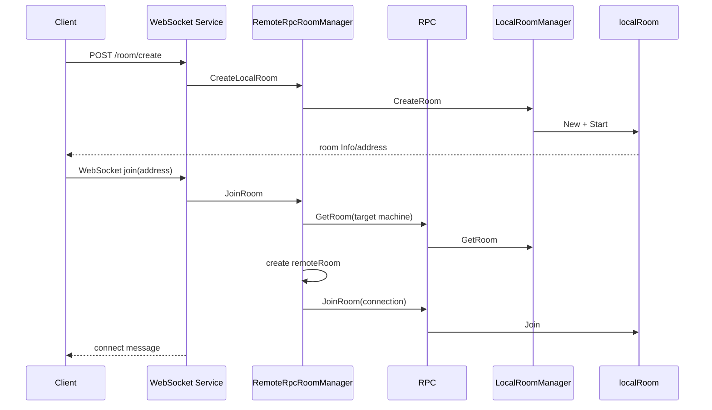
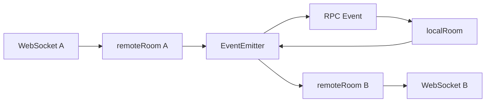
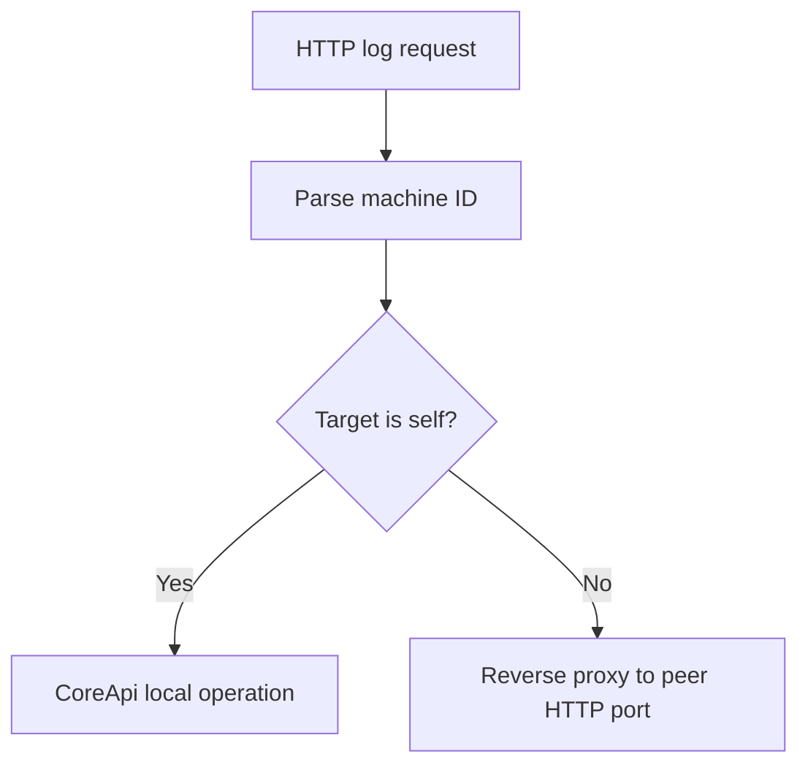
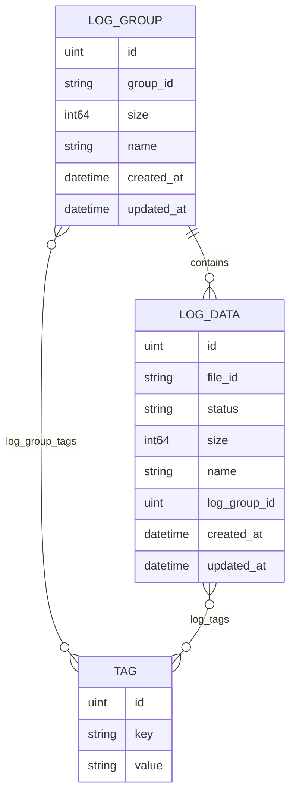
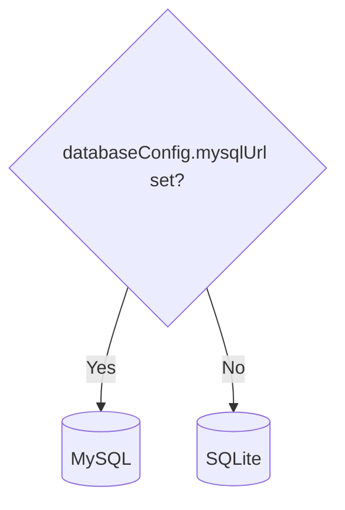
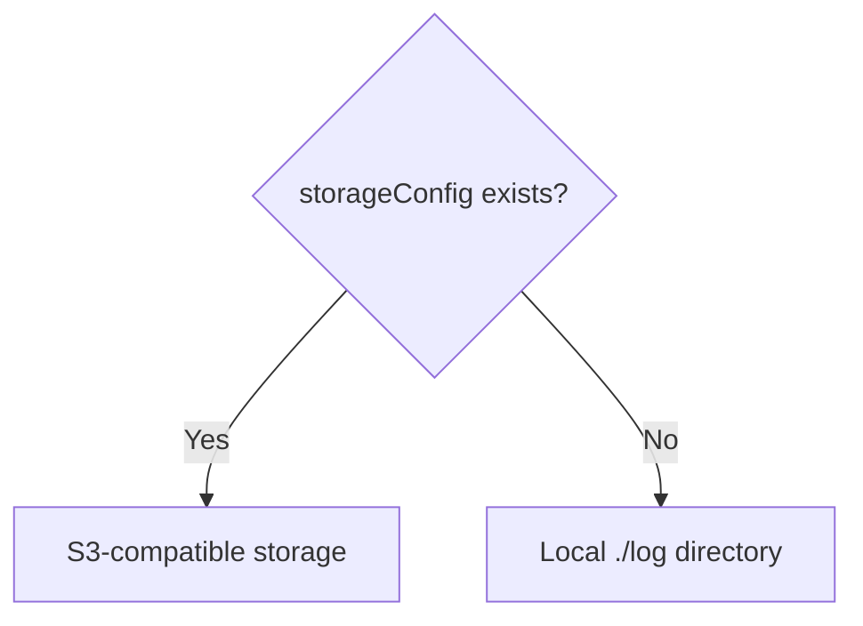

# Page Spy API 项目结构与设计

本文描述 Page Spy API 当前实现的模块边界、启动过程、核心数据模型、消息链路、存储设计和多实例拓扑，供开发、评审和故障排查使用。

## 1. 设计目标

Page Spy API 将远程调试场景拆为两类能力：

1. 实时通道：使用房间和 WebSocket 在调试端、被调试端之间转发消息。
2. 持久化日志：上传、检索、下载和分组保存调试日志。

服务同时支持：

- 单实例运行：随机选择内部 RPC 端口，machine ID 为 `local`。
- 多实例运行：通过固定 RPC 节点列表发现其他实例。
- 本地部署：SQLite + 本地文件系统。
- 外部基础设施：MySQL + S3 兼容存储。
- 一体化部署：后端同时托管 page-spy-web 静态资源。
- 嵌入式部署：作为 Go 模块注册到自定义 `main` 中。

## 2. 总体架构



HTTP 与 WebSocket 共用配置端口；内部 RPC 使用独立端口和 `/rpc` 路径。

## 3. 目录结构

```text
page-spy-api/
├── api/
│   ├── event/              跨模块事件地址、包和监听器接口
│   └── room/               房间、连接、消息、错误和接口定义
├── bin/
│   └── main.go             嵌入 dist 并启动完整服务
├── config/                 配置模型、默认配置、文件和环境变量加载
├── container/              dig 依赖注入容器
├── data/                   GORM 数据模型与 SQLite/MySQL 实现
├── event/                  本地事件总线和远程事件 RPC 服务
├── logger/                 全局 logrus 入口
├── metric/                 可注入的指标抽象，默认空实现
├── proxy/                  多实例 HTTP 反向代理
├── room/                   本地/远程房间及 RPC 房间管理
├── rpc/                    节点地址、RPC server/client 和结果聚合
├── serve/
│   ├── common/             统一 HTTP 响应
│   ├── middleware/         认证、CORS、日志、错误、缓存
│   ├── route/              HTTP 路由和日志领域服务
│   └── socket/             WebSocket 握手、会话和消息循环
├── state/                  原子状态机
├── static/                 SPA fallback 文件系统
├── storage/                本地文件与 S3 存储实现
├── task/                   周期任务调度
├── test/
│   ├── docker/             MySQL 手工测试环境
│   └── websocket_event_test/ 浏览器 WebSocket 测试页
└── util/                   文件、网络、时间和字节工具
```

### 3.1 API 与实现分离

`api/event` 和 `api/room` 只定义跨模块类型与接口，具体实现位于顶层 `event`、`room` 包中。

这种组织允许：

- `serve/socket` 依赖房间接口，而不是具体本地房间。
- 本地和远程房间使用相同消息模型。
- RPC response 复用领域错误类型。
- 测试通过小型 fake 替换事件、房间或存储实现。

## 4. 启动与依赖注入

项目使用 `go.uber.org/dig`。

### 4.1 启动入口

`bin/main.go` 完成两件事：

1. 将 `bin/dist/*` 嵌入二进制。
2. 向容器提供 `*config.StaticConfig`，然后调用 `serve.Run()`。

纯后端嵌入方也必须提供同一类型，但可以返回 `nil`。

### 4.2 Provider 图



### 4.3 启动顺序中的副作用

构造函数不只是创建对象：

- `rpc.NewRpcManager` 会异步启动 RPC HTTP server。
- `socket.NewManager` 会启动本地和远程房间管理器，并注册房间、事件 RPC 服务。
- `data.NewData` 在远程存储模式下注册数据库同步任务。
- `route.NewCore` 在本地存储模式下注册日志清理任务，并注册 Core RPC 服务。
- `route.NewEcho` 注册中间件、HTTP、WebSocket 和静态资源路由。
- `serve.Run` 最后启动 Echo HTTP server。

修改构造函数时要注意这些运行期副作用和依赖顺序。

## 5. 地址和节点模型

### 5.1 单实例

没有 `rpcAddress` 时：

- machine ID 固定为 `local`。
- RPC 监听地址记录为 `127.0.0.1:<random-port>`。
- 房间和连接地址格式为 `<uuid>.local`。

### 5.2 多实例

配置多个 RPC 地址时，所有 `ip:port` 排序后依次生成：

```text
A0
A1
A2
...
```

当前实例通过 `selfRpcAddress` 或本机 IP 匹配确定 machine ID。所有节点必须使用相同列表，否则相同机器可能得到不同 ID。

HTTP 反向代理使用当前节点配置的 `port` 拼接目标节点 IP，因此集群节点还必须使用相同的 HTTP 端口。

### 5.3 标识格式

| 对象 | 格式 | 示例 |
| --- | --- | --- |
| 房间地址 | `<local-id>.<machine-id>` | `9a...f2.A0` |
| 连接地址 | `<local-id>.<machine-id>` | `52...c1.A1` |
| 日志文件 ID | `<machine-id>.<md5>` | `A0.098f6bcd...` |

地址中的 machine ID 决定房间或事件 RPC 的目标节点；日志文件 ID 的第一个字段决定下载和删除请求的代理节点。

## 6. HTTP 层

### 6.1 中间件顺序

Echo 全局注册：

1. 请求日志与 `X-Request-ID`。
2. 统一错误响应。
3. CORS。

受保护路由组额外注册 JWT Auth 中间件。未配置系统密码时 Auth 会放行。

### 6.2 路由分组

```text
/api/v1
├── 公共
│   ├── POST /auth/verify
│   ├── POST /room/create
│   ├── GET  /room/check
│   ├── GET  /ws/room/join
│   ├── POST /log/upload
│   ├── POST /jsonLog/upload
│   └── POST /logGroup/upload
└── 受保护
    ├── GET    /auth/status
    ├── GET    /room/list
    ├── GET    /log/count
    ├── GET    /log/download
    ├── GET    /log/list
    ├── DELETE /log/delete
    ├── GET    /logGroup/list
    ├── GET    /logGroup/files
    └── DELETE /logGroup/delete
```

静态资源存在时，最后注册 `/*`，使用 `index.html` 作为 SPA fallback。

### 6.3 日志上传数据流



当前顺序是“先文件、后元数据”。任一步失败时没有跨存储事务，调用方和运维任务需要关注孤儿文件或孤儿记录。

### 6.4 查询、下载与删除

- 列表查询通过 RPC 调用所有节点的 `CoreApi.FindLogs` 或 `FindLogGroups`，合并后按创建时间倒序。
- 日志列表会按 file ID 去重。
- 下载根据 file ID 中的 machine ID 决定本地处理或 HTTP 反向代理。
- 删除同样根据 machine ID 选择节点，然后依次删除正文和数据库记录。

## 7. 房间与 WebSocket

### 7.1 核心对象

| 对象 | 职责 |
| --- | --- |
| `LocalRoomManager` | 保存当前节点创建的真实房间。 |
| `RemoteRpcRoomManager` | 面向 HTTP/WebSocket 的集群房间门面。 |
| `localRoom` | 维护房间信息、连接列表和广播逻辑。 |
| `remoteRoom` | 代表某个 WebSocket 连接到目标房间的会话。 |
| `LocalEventEmitter` | 以 connection address 为 key 分发本地事件。 |
| `RpcEventEmitter` | 把其他节点的事件注入本地事件总线。 |

### 7.2 创建与加入



即使房间位于本机，`RemoteRpcRoomManager` 也通过统一 RPC client 调用本地 RPC server，从而保持单节点和多节点路径一致。

### 7.3 消息流

客户端允许发送四类消息：

```text
ping
broadcast
message
updateRoomInfo
```

广播或单播链路：



`event.Package` 是房间消息跨节点传输的信封，包含：

- `From`
- `CreatedAt`
- `RequestId`
- `RoutingKey`
- JSON `Content`

### 7.4 状态与超时

通用状态机包含：

```text
Init -> Running -> Close
             \-> Error
```

房间管理器每 10 秒检查一次：

- 初始化后 1 分钟无人连接：关闭。
- 运行中全部用户离开超过 1 分钟：关闭。
- 运行中 5 分钟无活动：关闭。
- 本地房间存在超过 1 小时：关闭。
- remote room 无活动超过 20 秒或存在超过 1 小时：关闭。

这些时间目前是代码常量，不在 `config.json` 中。

## 8. RPC 与集群通信

### 8.1 协议

RPC server 使用 Gorilla RPC JSON codec：

```text
POST http://<node-ip>:<rpc-port>/rpc
Content-Type: application/json
```

请求包含方法名、参数数组和递增 id。主要服务：

| RPC 服务 | 用途 |
| --- | --- |
| `LocalRpcRoomManager` | 房间创建、查询、更新、Join、Leave、删除。 |
| `RpcEventEmitter` | 向目标节点上的连接投递事件。 |
| `CoreApi` | 查询节点本地日志或日志组。 |

### 8.2 HTTP 代理与 RPC 的分工

- 房间控制、事件消息、列表聚合使用 RPC。
- 日志下载和删除在目标节点处理时使用 Echo 层反向代理。



## 9. 数据与存储

### 9.1 领域数据模型



GORM 启动时自动迁移 `LogGroup`、`LogData` 和 `Tag`。

日志状态：

- `Created`
- `Saved`
- `Error`
- `Unknown`

正常创建流程最终写入 `Saved`。

### 9.2 数据库选择



SQLite 文件选择顺序：

1. 工作目录的 `data.db`。
2. `data/data.db`。
3. 不存在时创建 `data/data.db`。

### 9.3 正文存储选择



`StorageApi` 统一提供：

- `SaveLog`
- `GetLog`
- `ExistLog`
- `RemoveLog`
- 通用路径的 `Save` / `Get` / `Exist`

本地实现固定使用 `./log`。S3 实现使用 `baseDir/logDir/fileId`。

### 9.4 后台任务

| 任务 | 条件 | 周期 | 作用 |
| --- | --- | --- | --- |
| `clean_file` | 本地文件存储 | 10 分钟 | 按总容量和创建时间清理日志。 |
| `sync_data_file` | 远程对象存储 | 5 分钟 | 把本地 SQLite 文件同步到对象存储。 |
| room manager loop | 始终 | 10 秒 | 清理超时或关闭房间。 |

`metric` 包默认使用空实现，宿主程序可以调用 `metric.SetMetric` 注入监控系统。

## 10. 静态资源服务

`StaticConfig.Files` 必须包含名为 `dist` 的目录。Echo 将该目录包装为 fallback 文件系统：

- 文件存在：返回实际静态文件。
- 文件不存在：返回 `index.html`，支持前端 history 路由。

缓存中间件只用于静态资源通配路由，不影响 `/api/v1`。

## 11. 扩展指南

### 11.1 新增 HTTP API

1. 在 `serve/route/route.go` 选择公共或受保护路由组。
2. 复杂业务逻辑放入 `CoreApi` 或独立领域服务，不要堆在 handler。
3. 使用 `common.NewSuccessResponse` 和统一错误中间件。
4. 明确多实例下是本地操作、RPC 聚合还是 HTTP 代理。
5. 增加参数、鉴权、错误路径和多节点测试。

### 11.2 新增 WebSocket 消息

1. 在 `api/room/room.go` 添加类型常量和 content 结构。
2. 更新 `NewMessageContent`。
3. 决定是否加入 `IsPublicMessageType`。
4. 在 `remoteRoom` 和/或 `localRoom` 实现路由。
5. 确认 `roomMessageToPackage`、`packageToRoomMessage` 可以序列化。
6. 补充本地、跨节点、畸形消息和关闭场景测试。

### 11.3 新增存储实现

实现 `storage.StorageApi`，并在 `storage.NewStorage` 中根据显式配置选择实现。需要保持：

- file ID 和对象 key 稳定。
- `Get` 返回的 reader 由调用方关闭。
- 不存在对象与真正存储错误可区分。
- 文件正文与数据库元数据的失败补偿策略明确。

### 11.4 新增数据库

`data.DataApi` 是领域边界。新增数据库实现时要保持：

- 时间范围使用 Unix 秒输入。
- tag 多条件查询语义一致。
- 分页从 1 开始。
- GORM JSON 模型兼容。
- 集群聚合时 `Page.Merge`、排序和去重行为一致。

## 12. 设计约束与风险边界

当前实现需要特别关注：

- 认证关闭是默认行为，公共上传和 WebSocket 路由也不经过 JWT 中间件。
- RPC 监听所有网卡，没有内建认证和 TLS，必须依赖网络隔离。
- HTTP、WebSocket 请求体没有统一大小和速率限制。
- 文件正文与数据库元数据不是同一事务。
- 跨节点列表由每个节点先分页再合并，不等同于严格的全局分页。
- 跨节点 RPC 目前顺序执行，一个节点失败会使整体调用失败。
- S3 模式同步活动 SQLite 文件；多节点共享同一快照对象存在覆盖风险。
- 全局 container、logger 和 metric 使用进程级状态，测试需要注意隔离。
- 部分构造函数会立即启动 goroutine 或监听端口，不是纯对象构造。

涉及上述边界的修改应先形成迁移方案和兼容性说明，再进入实现。

## 13. 关键源码入口

| 关注点 | 入口 |
| --- | --- |
| 进程启动 | `bin/main.go`, `serve/run.go` |
| 依赖图 | `container/container.go` |
| 配置加载 | `config/load.go`, `config/config.go` |
| HTTP 路由 | `serve/route/route.go` |
| 日志领域逻辑 | `serve/route/core.go` |
| WebSocket 会话 | `serve/socket/socket.go` |
| 房间管理 | `room/local_manager.go`, `room/rpc_remote_manager.go` |
| 房间消息 | `room/local_room.go`, `room/remote_room.go`, `room/message.go` |
| 事件路由 | `event/local_event.go`, `event/rpc_event.go` |
| RPC 拓扑 | `rpc/address.go`, `rpc/rpc.go`, `rpc/rpc_client.go` |
| 数据库 | `data/db.go`, `data/logs.go` |
| 文件/S3 | `storage/file.go`, `storage/s3.go` |
| 周期任务 | `task/task.go` |
